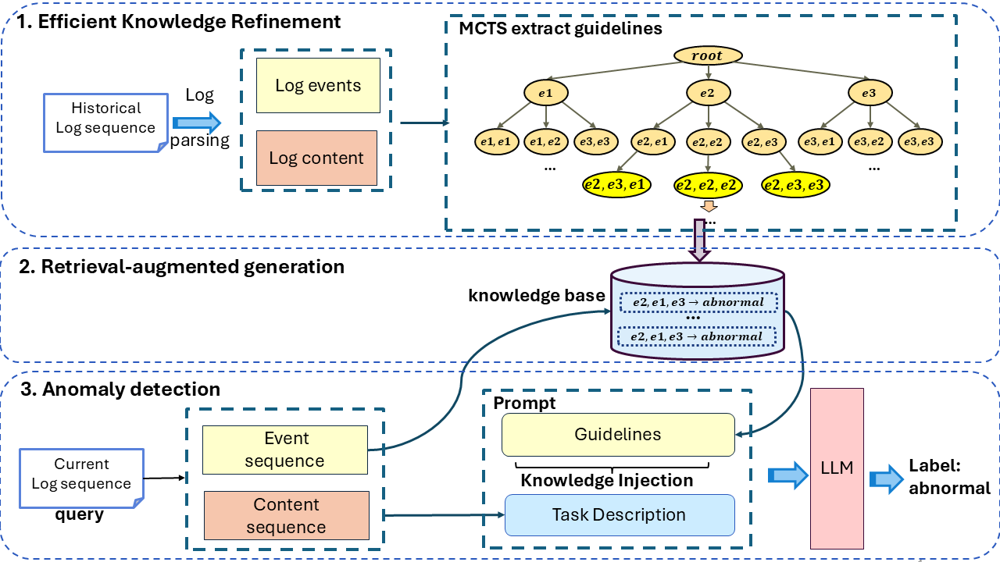

# LLMGLog: Log-based Anomaly Detection with LLMs and Knowledge Refinement
# Abstract
Log-based anomaly detection plays a critical role in ensuring the reliability and performance of software systems. Recently, large language models (LLMs) and Retrieval-Augmented Generations (RAGs) have demonstrated remarkable capabilities of intelligence in various domains. In this paper, we demonstrate four key concerns when leveraging LLMs and RAG to solve the log-based anomaly detection problem: accurate guidance, highdensity knowledge, explicit anomaly knowledge and guidance, and acceptable time and storage cost. We further propose a novel log-based anomaly detection approach based these concerns. The core idea is to refine and summarize knowledge from raw log data to create meaningful guidelines with high-density knowledge.
Experiments on three public datasets show that our method achieves over 90% F1 score outperforming existing LLM-based and DL-based methods. Additionally, the experiments indicate it can significantly reduce storage costs and retrieval time.

# overview

<div align="center">Figure 1: Overview of our approach.</div>

LLMs provide key advantages such as zero-shot learning, generalization, and the ability to detect "new" anomalies beyond the scope of traditional methods. In simple terms, guidelines offer high precision but low recall, while LLMs improve recall by identifying new anomalies. Combining both yields superior detection performance. We will add an ablation study showing results of using only guidelines.


# Demo

To extract guidelines from the HDFS dataset, run the following code:

data: https://github.com/logpai/loghub/tree/master/HDFS#hdfs_v1

```bash
Python mcts_hdfs_demo.py
```

The `result` directory stores the core experimental results, and the `rule_base` contains the extracted guidelines from four datasets.


### Quick Project Structure Overview:

- `config/hdfs`:
  - `LogRule_HDFS.yaml`: Configuration for processing HDFS logs.

- `dataset/HDFS_v1/preprocessed`: Stores the preprocessed HDFS dataset used for training and evaluation.
- `prompt`: Stores prompt templates.

- `result`: Contains evaluation results across various datasets.
  - `rule_base`: Stores rules extracted using MCTS from three datasets.

- `models`:
  - `llm_chat.py`: Implements a chat interface using large language models (LLM) for log analysis.
  - `LogRuleEvaluator.py`: Evaluates log rules to detect anomalies.
  - `LogRuleNode.py`: Defines the structure for log rule nodes used in the evaluation process.
  - `monte_carlo_tree_search_model.py`: Contains the Monte Carlo Tree Search (MCTS) model for optimizing log anomaly detection strategies.

- `demo/log_anomaly_detection`:
  - `mcts_hdfs_demo.py`: A demo script for anomaly detection using Monte Carlo Tree Search (MCTS) on HDFS logs.

=======
# RuLL
>>>>>>> be9e5913cf7d001b2020bd7033db180041cb4eac
